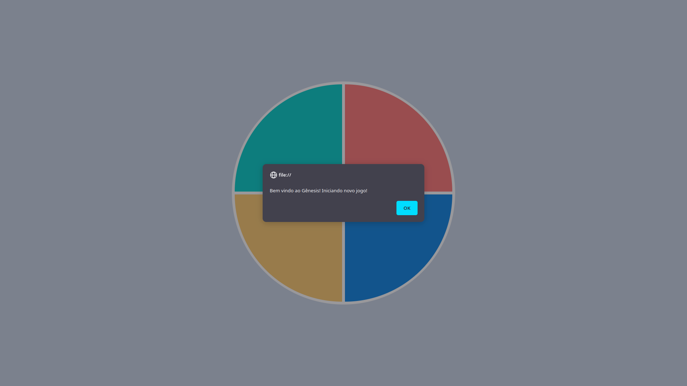
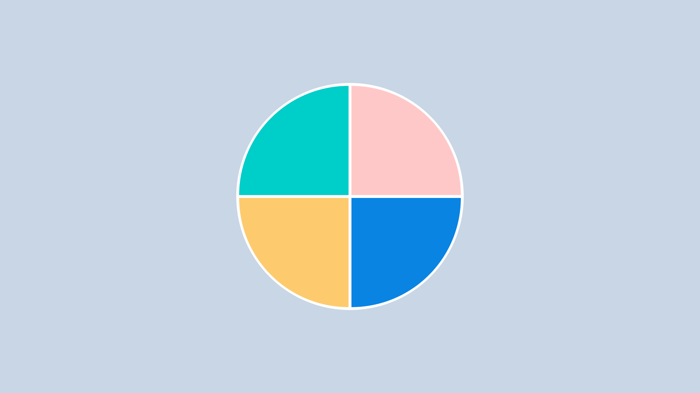

# Jogo de Memória

Este é um simples jogo de memorização através de cores onde, você deve clicar na sequência de de cores conforme vai sendo mostrado em sua tela.

A cada ciclo de acertos, é mostrado sua pontuação a você sobe um nível.

Caso você erre a sequência, o jogo é reiniciado e você deverá começar tudo novamente.

Abrir o jogo, basta baixar o repositório e abrir o arquivo `index.html` em qualquer navegador.

## Diveirta-se!!!

